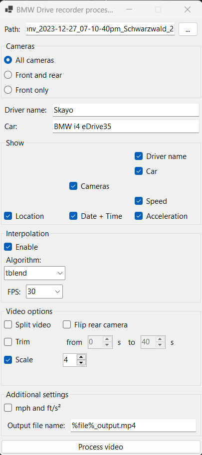

# BMW drive recorder processor
This tool provides some features to process BMW drive recorder recordings.

## Motivation
The BMW drive recorder App in iDrive 8.0 and 8.5 cars creates low quality recordings of all 4 external cameras (if the car is fitted with them at least) and a Metadata-file containing speed, date, time and location.
This app works as a dashcam replacement, but the exported files are not very useful to humans, as metadata and recording are seperated.

## Processing
In order to make the recordings more useful, this tool provides a few features to process these recordings.
This tool is basically a user friendly interface for [ffmpeg](https://ffmpeg.org/) with a additional subtitle generator.
It works by creating a subtitles.ass file from the Metadata.json file and writing a ffmpeg command containing all complex filters needed.

### Features:
* Converts drive recorder .ts files into any video-format supported by ffmpeg
* Adds the following metadata (or additional information) to a output video:
	* Name of the driver
	* Name of the car
	* Camera titles (front, rear, left and right)
	* Current speed
	* Acceleration (calculated from speed changes between frames)
	* GPS location (long. and lat.)
	* Date and time
* Frame interpolation to increase framerate
* Splitting the one video into different files for each camera
* Flipping the rear camera image, as it is mirrored by default
* Trimming the video
* Upscale video
* Save last settings

### Requirements:
* ffmpeg binary compiled with --enable-libass in your PATH or next to this tools executeable
* .NET 8.0 runtime
* A BMW with iDrive 8.0 or 8.5 including the drive recorder app

### Missing features/known bugs
* There is next to no error-handling
* The tool creates a log-file if ffmpeg finishes with an error, but it will not write the output of ffmpeg into it
* Acceleration value seems to be correct but is quite useless due to it's fast changes. (Maybe add a acceleration graph underneath the video?)
* As I only have a iDrive 8.5 BMW i4 from 2023, I don't know if Metadata-files are identical in iDrive 9, iDrive 7 and so on.
* On small screens, the window is too large
* Subtitles are generated for every camera when the video is split
* Video Resolution is fixed. Has to be fixed.